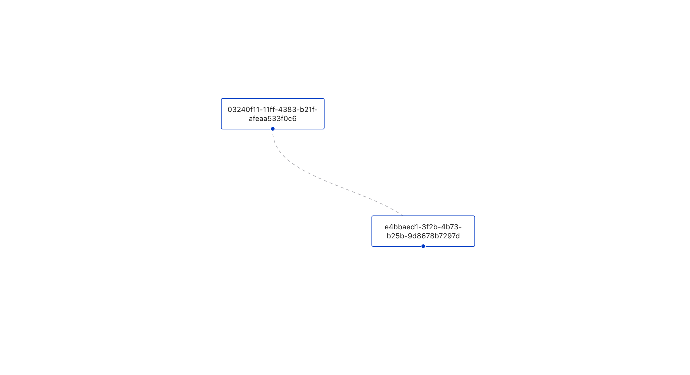

# System View (hosted on port 3000 by default)

A library for correlated system observability, driven by transaction logs

For the initial seed project, you will need the system-view-service running

https://github.com/aswhitehouse/system-view-service

service start = node system-v-service.js

UI start = yarn start

# Initial Seed View (how to know it's working)

